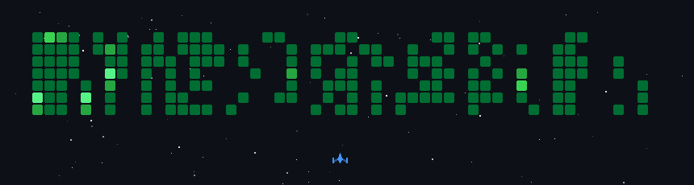

# 👋 Hello, world! 
###### Backend systems · Telegram bots · Web3 · Automation · Reverse Engineering

&nbsp;
&nbsp;
&nbsp;

 

---

Backend developer focused on building reliable, scalable systems.

I work with APIs, Telegram ecosystems, and Web3 infrastructure — from idea to production.  
My goal is simple: deliver solutions that actually work, scale, and bring value.

I care about architecture, performance, and clean code — not hype or overengineering.

▸ Main focus: backend systems, Telegram bots, automation  
▸ Stack: PHP, Node.js, Python, MySQL, PostgreSQL, Redis  
▸ Interests: high-load systems, API design, reverse engineering  

I don’t just write code — I build complete working products.

---

  

 

 

 

 

 

 

 

 

---

  

&nbsp;
&nbsp;
&nbsp;

---

▸ Telegram: <a href="https://t.me/aptyp4uk1337_bot?start=utm-github">@aptyp4uk1337_bot</a>  
▸ Discord: <a href="https://discord.com/users/841963614398578708">@aptyp4uk1337</a>  
▸ Email: <a href="mailto:aptyp4uk1337@gmail.com?subject=Hello from GitHub">aptyp4uk1337@gmail.com</a>

  

